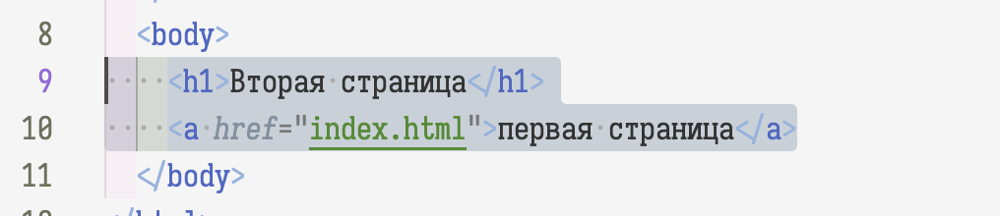
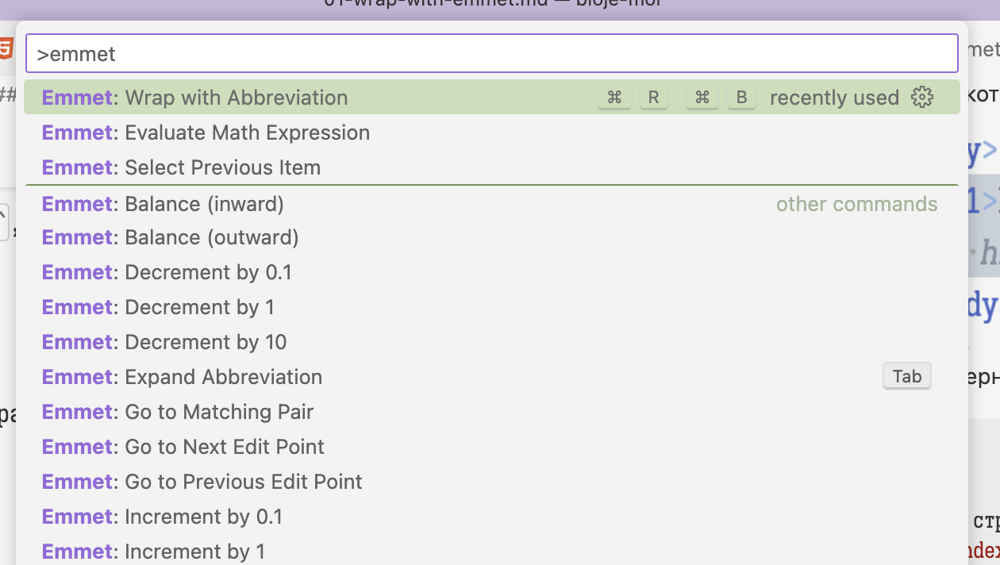
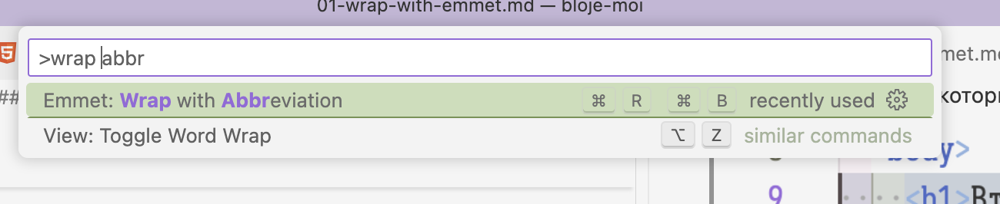
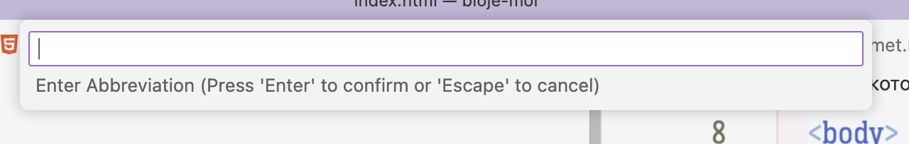

# Emmet

Здесь я рассмотрю разные возможности, которые представляет VSCode для ускорения написания кода

В основном речь будет идти про плагины из набора Emmet

> Emmet — набор плагинов для текстовых редакторов, которые в некоторой степени ускоряют написание кода HTML, XML, XSL, а также кода на некоторых других языках

Плагин встроен в VSC и устанавливать ничего не требуется

## Command Pallette 
Возьмем любую HTML-страницу и откроем ее в редакторе.

Выделим тот кусок, который хотим обернуть

Допустим, я хочу обернуть тегом `main`, вот так:
```html
 | <body>
+|   <main>  
 |     <h1>Вторая страница</h1>
 |     <a href="index.html">первая страница</a>
+|   </main>
 | </body>
```

нажимаем `ctrl+P` и в появившемся окне вводим `>`. Таким образом мы попадаем в окно ввода команд (command pallette, палитра? О_о)


> [!TIP]
> Возможно, такого же результата можно добиться, нажав `ctrl+shift+P`, но я не уверен, что на Windows работает именно эта комбинация

Здесь доступны практически все функции редактора
. Нас интересуют функции группы Emmet, поэтому вводим это название:


можно перемещаться по списку кнопками ⬆️⬇️, выбирая нужную функцию нажатием `Enter ⏎`, а так же мышкой. Если для функции определена комбинация клавиш, она будет отображена справа

Нас интересует функция "Wrap with abbreviation". abbreviation — это термин, который обозначает сокращенную запись html-структуры, подобную той, которую мы используем в css-селекторах. Полная информация о том, какие сокращения бывают, можно посмотреть в [шпаргалке](https://docs.emmet.io/cheat-sheet/)

Находим функцию в списке:


Необязательно писать полностью название, можно, как в примере, писать частями слов. Это полезно, когда не знаешь как точно называется то, что ты ищешь

Выделим "Wrap with abbreviation" и нажмем Enter, или нажмем мышкой на нее


Здесь нас просят ввести сокращение. Пока просто введем "main" — это соответствует тегу `<main>(выделенный текст)</main>`

по мере ввода можно заметить как код в самом редакторе меняется, показывая нам, что получится, когда мы нажмем `Enter`. Когда результат нас устроит, подтвердим его.

Если код в результате выглядит как ожидалось, значит мы молодцы!

Задание для закрепления: установи курсор внутрь тега `<main>` и используй функцию `Emmet: Go to Matching Pair`. Удобно ли это?