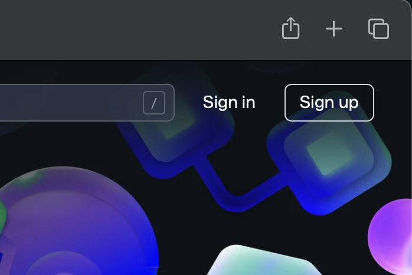

# как публиковать свои коммиты

Мы уже умеем пользоваться панелью контроля версий в VSC, чтобы делать коммиты, теперь пора их публиковать

В этом гайде мы будем публиковать их на гитхабе — самом распространенном хостинге git-репозиториев.

## регистрация 

 

Заходим на https://github.com/, жмем sign up

заполняем форму, емейл, пароль, логин, отказываемся от рассылок, жмем далее, решаем капчу (если надо), вводим код из почты, логинимся

сообщи мне логин, я приглашу тебя в репозиторий
